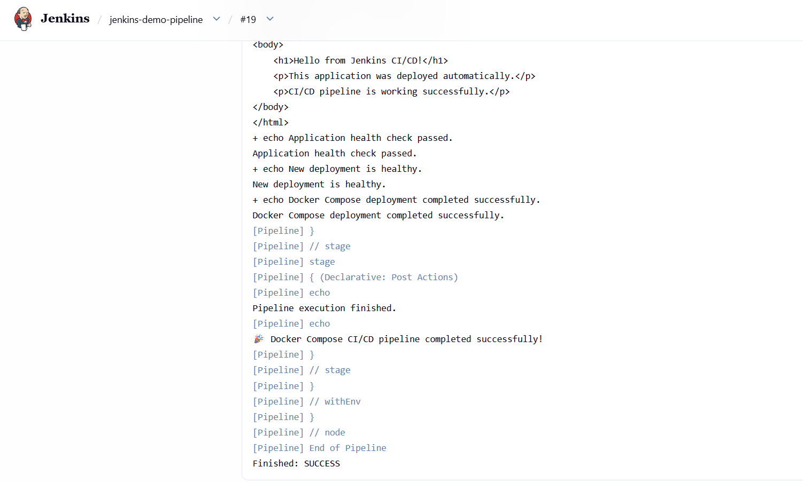
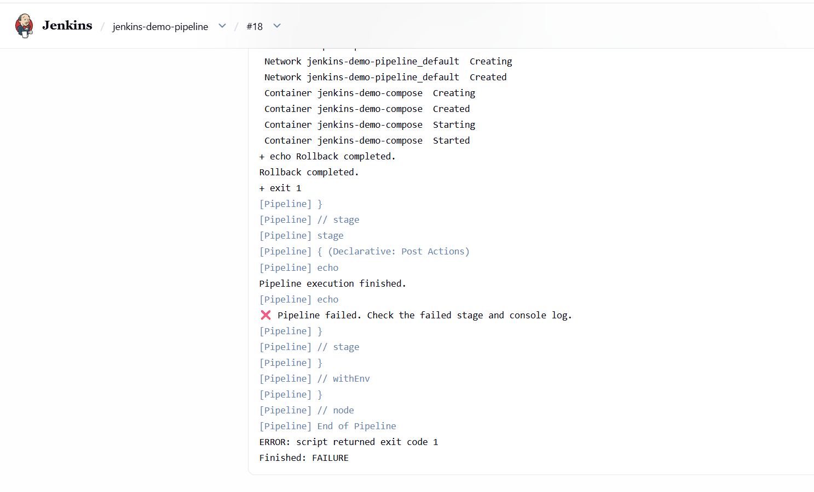
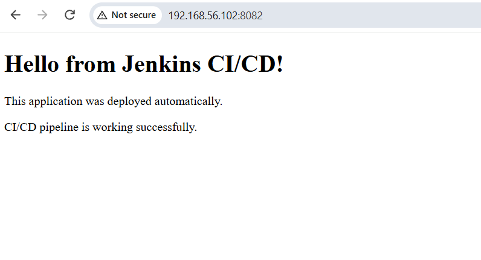

# Automated Docker CI/CD Pipeline with Jenkins

## 📌 Project Overview

This project demonstrates an automated CI/CD pipeline for deploying a web application using **Jenkins, GitHub, Docker, and Docker Compose**.

A GitHub push triggers Jenkins through a webhook. Jenkins checks out the latest source code, performs build and test validation, builds the Docker image, deploys the application using Docker Compose, performs an HTTP health check, and handles rollback when the new deployment fails the health check.

---

## 🏗️ Architecture

```text
Developer
    |
    | Git Push
    v
GitHub Repository
    |
    | Webhook
    v
Webhook Relay
    |
    v
Jenkins
    |
    +---- Build
    |
    +---- Test
    |
    +---- Docker Build
    |
    +---- Docker Compose Deploy
    |
    +---- Health Check
    |
    +---- Rollback if Failed
    |
    v
Docker Container
    |
    v
Nginx Web Server
    |
    v
Web Application
```

---

## 🛠️ Technologies Used

- Ubuntu Linux 22.04
- Jenkins
- Git
- GitHub
- GitHub Webhooks
- Webhook Relay
- Docker
- Docker Compose
- Nginx
- Bash / Shell Scripting
- HTML

---

## 🚀 CI/CD Workflow

1. Developer pushes changes to GitHub.
2. GitHub sends a webhook notification.
3. Webhook Relay forwards the event to Jenkins.
4. Jenkins checks out the latest source code.
5. Jenkins performs build validation.
6. Jenkins runs application tests.
7. Docker image is built.
8. Docker Compose deploys the application.
9. Jenkins performs an HTTP health check.
10. If the health check passes, the deployment succeeds.
11. If the health check fails, Jenkins restores the previous Docker image.
12. Jenkins reports the pipeline result.

---

## 📂 Project Structure

```text
jenkins-demo/
│
├── Dockerfile
├── compose.yaml
├── index.html
├── jenkinsfile
├── README.md
└── docs/
    └── images/
        ├── jenkins-pipeline-success.png
        ├── rollback-test.png
        └── application.png
```

| File | Description |
|------|-------------|
| `Dockerfile` | Defines the Docker image for the web application |
| `compose.yaml` | Defines the Docker Compose deployment |
| `index.html` | Web application |
| `jenkinsfile` | Jenkins CI/CD pipeline |
| `README.md` | Project documentation |

---

## 🐳 Dockerfile

```dockerfile
FROM nginx:alpine

COPY index.html /usr/share/nginx/html/index.html

EXPOSE 80
```

The Dockerfile uses Nginx Alpine as the base image and copies the HTML application into the Nginx web root.

---

## 🐳 Docker Compose

```yaml
services:
  web:
    image: jenkins-demo:latest
    container_name: jenkins-demo-compose
    ports:
      - "8082:80"
    restart: unless-stopped
```

The application is exposed on port `8082` of the CI server and port `80` inside the container.

---

## 🔧 Jenkins Pipeline

The Jenkins Declarative Pipeline performs the following activities:

### 1. Build

Checks whether the application file exists:

```bash
if [ -f index.html ]; then
    echo "index.html found."
else
    exit 1
fi
```

### 2. Test

Performs a basic application-content test:

```bash
grep -q "Jenkins" index.html
```

### 3. Docker Build

Builds the Docker image:

```bash
docker compose build
```

### 4. Docker Deployment

Starts the application:

```bash
docker compose up -d
```

### 5. Health Check

Checks whether the application responds successfully:

```bash
curl -f http://localhost:8082
```

---

## 🔄 Automatic Rollback

Before deploying the new version, Jenkins records the currently deployed image:

```bash
OLD_IMAGE=$(docker image inspect jenkins-demo:latest --format '{{.Id}}')
```

If the new deployment fails its health check, Jenkins performs:

```bash
docker compose down
docker tag "$OLD_IMAGE" jenkins-demo:latest
docker compose up -d
```

This restores the previous image and starts the application again.

---

## 🧪 Rollback Testing

The rollback mechanism was intentionally tested by changing the health-check endpoint to an unavailable port.

The pipeline detected the failed health check, restored the previous image, restarted the container, and marked the release attempt as failed.

```text
New Deployment
      ↓
Health Check Failed
      ↓
Docker Compose Down
      ↓
Previous Image Restored
      ↓
Docker Compose Up
      ↓
Rollback Completed
      ↓
Jenkins Build Marked FAILURE
```

After testing, the health check was restored and the application was successfully deployed again.

---

## 📸 Project Screenshots

### Successful Jenkins Pipeline

The successful Build #19 shows the application health check, successful Docker Compose deployment, post actions, and `Finished: SUCCESS`.



### Rollback Test

Build #18 demonstrates the rollback scenario. The pipeline restored the previous image and then returned `Finished: FAILURE` because the intentionally failed health check caused the release to fail.



### Running Application

The deployed web application is accessible through the browser and displays the CI/CD deployment message.



---

## 🔗 Complete CI/CD Flow

```text
GitHub Push
     ↓
GitHub Webhook
     ↓
Webhook Relay
     ↓
Jenkins Pipeline
     ↓
Build
     ↓
Test
     ↓
Docker Image Build
     ↓
Docker Compose Deployment
     ↓
HTTP Health Check
     ↓
 ┌───────────────┐
 │               │
Healthy       Unhealthy
 │               │
 ↓               ↓
SUCCESS       Rollback
                 ↓
          Previous Image
                 ↓
              FAILURE
```

---

## 🎯 Project Objectives

- Implement a practical Jenkins CI/CD pipeline.
- Integrate GitHub with Jenkins using webhooks.
- Automate application build and testing.
- Containerize a web application using Docker.
- Deploy the application using Docker Compose.
- Implement application-level health checks.
- Implement and test automated rollback.
- Gain practical Linux and DevOps experience.

---

## 📈 Key Learning Outcomes

- Jenkins Declarative Pipelines
- GitHub integration
- Webhook-based CI/CD
- Docker image creation
- Docker containers
- Docker Compose
- Linux administration
- Bash scripting
- Nginx
- Automated deployment
- Application health checks
- Deployment rollback
- CI/CD troubleshooting

---

## 🧪 Project Validation

### Successful Deployment

- GitHub webhook triggered Jenkins automatically.
- Build stage passed.
- Test stage passed.
- Docker image was built.
- Docker Compose deployment completed.
- HTTP health check passed.
- Jenkins reported `SUCCESS`.

### Rollback Test

- The health-check endpoint was intentionally made unavailable.
- Jenkins detected the failed health check.
- The previous Docker image was restored.
- The container was restarted.
- Jenkins correctly marked the release attempt as `FAILURE`.

The health check was then restored and the final deployment succeeded.

---

## 🔐 Security Notes

This project was implemented as a learning/lab environment.

For production environments:

- Use Jenkins Credentials or a dedicated secrets manager for sensitive information.
- Avoid giving Jenkins unrestricted Docker access where possible.
- Secure webhook endpoints.
- Use HTTPS/TLS.
- Use private container registries.
- Prefer immutable image tags such as Git commit SHA or build number.
- Apply least-privilege access controls.

---

## 🔮 Future Improvements

- Docker Registry integration
- Immutable Docker image tags
- Automated unit and integration testing
- Improved readiness and health checks
- Monitoring and centralized logging
- AWS/Azure cloud deployment
- Terraform
- Ansible
- Kubernetes
- CI/CD notifications

---

## 👨‍💻 Author

**Likesy Saviyo**

DevOps | Linux | Cloud | Software Development

---

## 📌 Project Summary

This project demonstrates an end-to-end automated CI/CD workflow using Jenkins, GitHub, Docker, and Docker Compose, including automated deployment, application health validation, and rollback handling.

The project was implemented and tested on an Ubuntu Linux environment.
